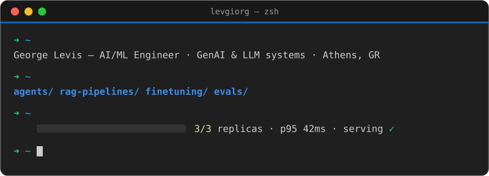

## Stack

<picture>
  <source media="(prefers-color-scheme: dark)" srcset="https://raw.githubusercontent.com/levgiorg/levgiorg/output/github-snake.svg" />
  <source media="(prefers-color-scheme: light)" srcset="https://raw.githubusercontent.com/levgiorg/levgiorg/output/github-snake-light.svg" />
  
</picture>

